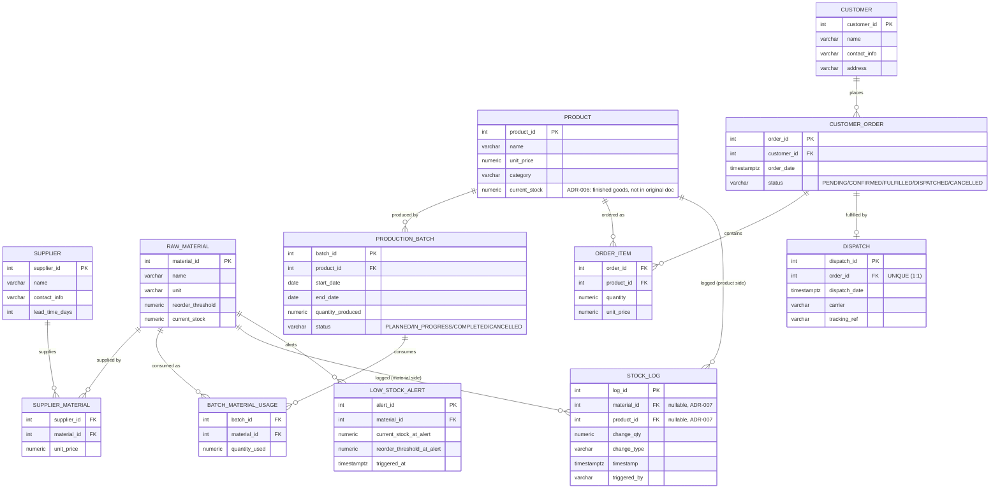

# StockLoom — ER Diagram

Derived directly from `database/schema.sql`. Renders as a diagram on
GitHub/GitLab (Mermaid) or any Mermaid-compatible viewer.

## Notes for the viva

- `SUPPLIER_MATERIAL` and `BATCH_MATERIAL_USAGE` are the two junction
  tables resolving the documented M:N relationships (Supplier↔RawMaterial,
  ProductionBatch↔RawMaterial). `ORDER_ITEM` resolves CustomerOrder↔Product.
- `STOCK_LOG` has **two** optional FKs (`material_id`, `product_id`) with a
  `CHECK` enforcing exactly one is set per row — see
  `ARCHITECTURE_DECISIONS.md` ADR-007 for why, and
  `docs/ER_MODEL_PROPOSAL.md` for the full reconciliation against the
  original project documentation, which only documented a `material_id`
  column.
- `PRODUCT.current_stock` and `LOW_STOCK_ALERT` were **not** in the original
  project documentation's entity table — both are explicit, documented
  clarifications (ADR-006, ADR-008) of a genuine gap in that documentation,
  not literal transcriptions of it. See `docs/ER_MODEL_PROPOSAL.md`.
